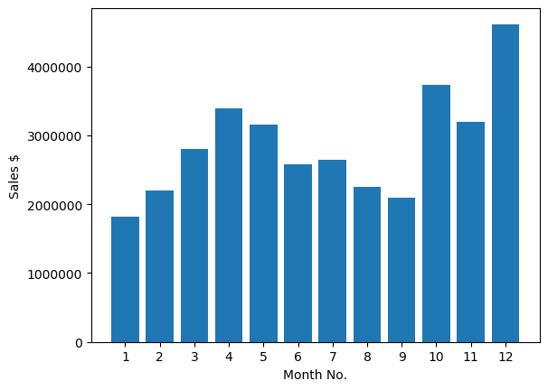
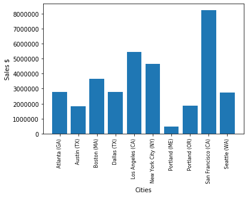
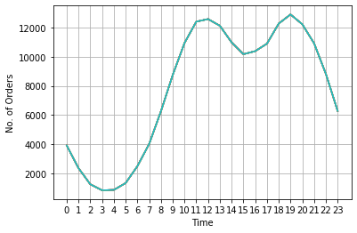
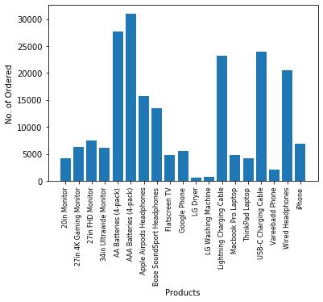
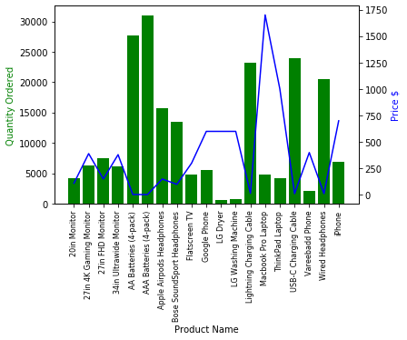

# Sales-Data-Analysis

## Language: Python

## Libraries: 
### i) pandas
### ii) matplotlib.pyplot

## Analysis:

### Q1: What was the best month for sale? How much was earned that month?
### -->

#### The month of December is best for sale. Almost 5 million $ has been earned.

### Q2: What City has highest no. of Sales?
### -->

#### San Francisco has the highest number of sales with over 8 million $.

### Q3: What time should we display advertisements to maximize likelihood of customer's  buying product?
### -->

#### The time of ad recommendations is around 11/12am and 7pm. In this time, customer's are more active in buying.

### Q4:  What products are most often sold together?
### -->

#### The products most sold together are
##### ('iPhone', 'Lightning Charging Cable') 1005
##### ('Google Phone', 'USB-C Charging Cable') 987
##### ('iPhone', 'Wired Headphones') 447
##### ('Google Phone', 'Wired Headphones') 414
##### ('Vareebadd Phone', 'USB-C Charging Cable') 361
##### ('iPhone', 'Apple Airpods Headphones') 360
##### ('Google Phone', 'Bose SoundSport Headphones') 220
##### ('USB-C Charging Cable', 'Wired Headphones') 160
##### ('Vareebadd Phone', 'Wired Headphones') 143
##### ('Lightning Charging Cable', 'Wired Headphones') 92

### Q5: What product sold the most? Why do you think it sold the most?
### -->

#### AAA Batteries (4-Pack) is the most sold product.
#### The top five selling products are
#### i)   AAA BAtteries (4-Pack)
#### ii)  AA BAtteries (4-Pack)
#### iii) USB-C Charging Cable 
#### iv)  Lighting Charging Cable
#### v)   Wired Headphones

#### The items with least price sold most. This indicates inverse relation of quantiy sold with price of unit.

